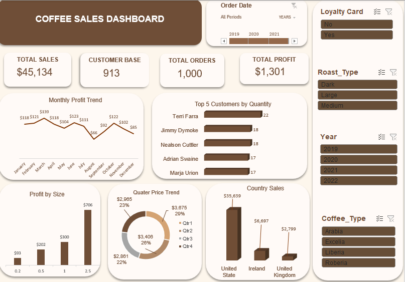

# Coffee Sales Dashboard Analysis (Excel)

## Overview
This project analyses coffee sales transactions from 2019–2022 using an interactive dashboard built in Excel.

The goal is to understand sales performance, customer behavior and product profitability.

---

## Business Questions
- Which countries generate the most revenue?
- Who are the top purchasing customers?
- How does profit change across months?
- Which product sizes generate the most profit?
- How are sales distributed across quarters?

---

## Data Preparation 
- Cleaned the dataset by removing duplicates  
- Combined multiple sheets using lookup functions  
- Standardised product categories  
- Built an interactive dashboard using Pivot Tables and slicers  

---

## Key Insights
- Total sales reached **$45,134** from ~1,000 orders  
- The customer base includes **913 unique customers**  
- Sales are heavily concentrated in the **United States**  
- Larger product sizes generate the highest profit contribution  
- Profit fluctuates across months with a drop around August  

---

## What I Learned

- How to structure raw data for pivot table analysis
- How to use VLOOKUP to combine multiple datasets
- How to design an interactive Excel dashboard using slicers
- How to present insights clearly using charts and summary metrics

---

## Tools Used
- Microsoft Excel  
- Pivot Tables  
- VLOOKUP  
- IF Functions
- Data Visualization

---

## Dashboard Preview

---

## Project File
- Coffee Sales.xlsx  
  
